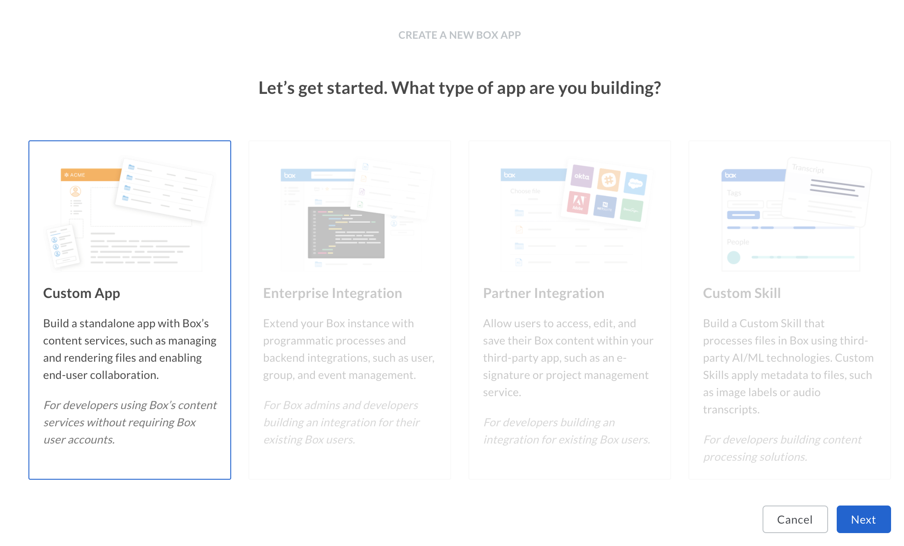
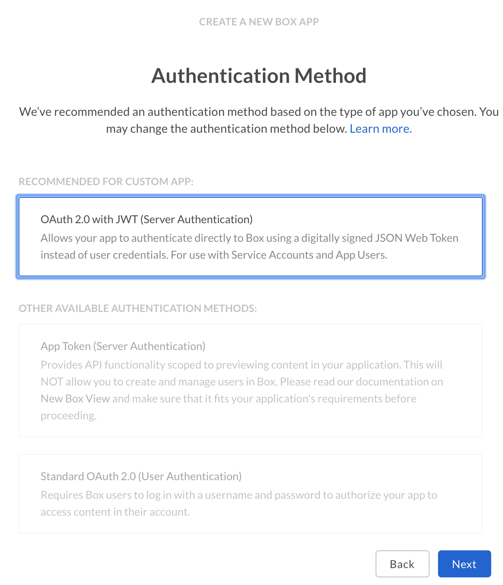
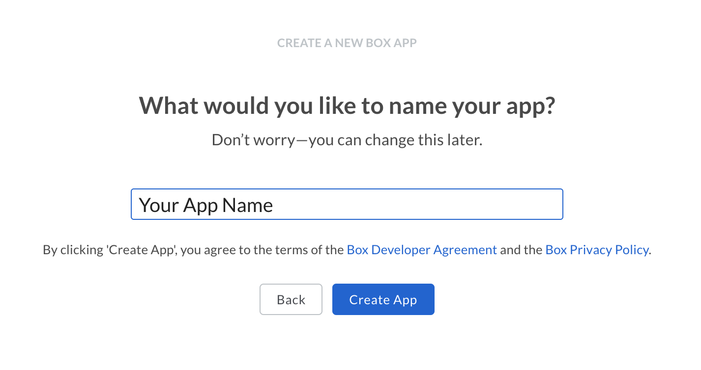
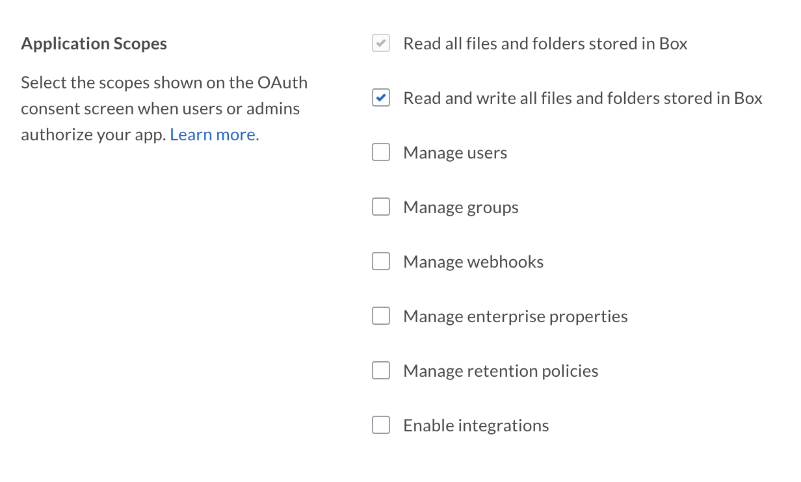

# Setup with JWT

A Custom App can be set up to use server-side authentication with
[JWT][jwt].

<CTA to='g://authentication/jwt'>
Learn how JWT authentication works

</CTA>

## Prerequisites

To set up a Custom App using JWT authentication you will need to pass the
following requirements.

* You need to be a be able to access the [Developer Console][devconsole] for
  your enterprise, or sign up for a [developer account][devaccount].

## Create the app

### 1. Log in to the Developer Console

Head over to the [Developer Console][devconsole] and select "Create New App".

### 2. Create a Custom App

Select the "Custom App" option from the list of application types and select
"Next".

<ImageFrame border>



</ImageFrame>

### 3. Select OAuth 2.0 authentication

On the next screen, select "OAuth 2.0 with JWT (Server Authentication)" and select
"Next".

<ImageFrame border width="400" center>



</ImageFrame>

### 4. Provide a name

Finally, provide a unique name for your application. This name needs to be
unique across all applications on Box.

<ImageFrame border width="600" center>



</ImageFrame>

## JWT keypair

JWT authentication work through a public/private RSA keypair. This keypair can
be generated on the developer console, or alternatively the developer can
provide their own public key.

### Generate a keypair (Recommended)

After a Custom App has been created to use JWT authentication, there is an
available in the [Developer Console][devconsole] to have Box create a
configuration file. This file will include the keypair as well as a number of
other application details that are used used during authentication.

Click on the "Configuration" option from the left sidebar in your application
and scroll down to the "Add and Manage Public Keys" section.

<ImageFrame border width="600" center>


</ImageFrame>

Click the "Generate a Public/Private Keypair" button to have Box generate a
keypair. This will trigger the download of a JSON configuration file that you
can move to your application code.

<Message danger>

Box will not store your private key as this would be a security concern.
Please do not loose your private key or the entire keypair needs to be reset.

</Message>

### Manually add keypair

An alternative to having Box generate the public/private keypair is to manually
generate a keypair and upload the public key to the Box developer console.

To create the keypair using OpenSSL, open a terminal window and run the
following commands.

```shell
openssl genrsa -des3 -out private.pem 2048
openssl rsa -in private.pem -outform PEM -pubout -out public.pem
```

<Message>

# For Windows Systems

Windows users can install and use the [Cygwin][cygwin] package to run OpenSSL.

</Message>

Next, head over to your application in the [developer console][devconsole] and
select the"Configuration" link from the left sidebar in your application
and scroll down to the "Add and Manage Public Keys" section.

<ImageFrame border width="600" center>


</ImageFrame>

Click the "Add a Public Key" button to have Box upload the public key you
created before.

## App Authorization

Once a keypair has been added to the application it will need to be authorized
within the Box enterprise by the enterprise Admin User.

Head over to your application in the [developer console][devconsole] and
select the "General" link from the left sidebar in your application
and scroll down to the "App Authorization" section.

<ImageFrame border width="400" center>


</ImageFrame>

This will send an email to your enterprise admin to have them enable your
application. More information on this process is available in our [community
article on app authorization][app-auth].

### Re-authorization on changes

When the application's scopes or access level change the application needs to be
re-authorized. Repeat the process above and request a new Access Token for the
new changes to take effect.

## Basic configuration

Before the application can be used, some basic additional configuration might be
required.

### Application Access

By default the application will will only be able to work with its own data and
the data of any [App Users][user-types] that it creates. To also work with
existing Managed Users in the entire enterprise the application needs to be
enabled for "Enterprise Access".

<ImageFrame border>


</ImageFrame>

### Application Scopes

These options define what permissions your application has to access data. See
the [scopes guide][scopes] for detailed information on each option.

<ImageFrame border width="600" center>



</ImageFrame>

### CORS Domains

If your application is making API calls from front-end browser code in
Javascript then the domain that these calls will be made from will need to be
whitelisted for [Cross Origin Resource Sharing][cors], also known as CORS.

Fill in the full URI(s) of the domains that should be enabled in your
application to make these kind of requests. If all requests will be made from
server-side code, this section may be left blank.

<ImageFrame border>


</ImageFrame>

[devconsole]: https://app.box.com/developers/console
[devaccount]: https://account.box.com/signup/n/developer
[devtoken]: g://authentication/access-tokens/developer-tokens
[scopes]: g://api-calls/permissions-and-errors/scopes
[cors]: https://en.wikipedia.org/wiki/Cross-origin_resource_sharing
[user-types]: g://authentication/user-types
[cygwin]: http://www.cygwin.com/
[app-auth]: https://community.box.com/t5/Managing-Developer-Sandboxes/Authorizing-Apps-in-the-Box-App-Approval-Process/ta-p/77293
[jwt]: g://authentication/jwt
