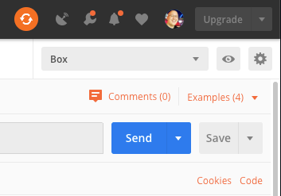

<!-- alex disable postman-postwoman -->

# Make an API call

With the **Box Postman Collection** loaded into the **Postman App** it is
possible to make API calls to the **Box API** on behalf of the user logged
in as.

<Message warning>

The Box Postman Collection will require a valid `access_token` environment
variable to make API calls. To get your Postman App set up with a valid Access
Token we recommend following our [Quick
Start](g://tooling/postman/quick-start) guide.

</Message>

## Make an API request

To make an API request, select a **Request** from the Box Postman Collection. In
this example, we will use the **List items in folder** API which can be found
in the **Folders** folder.

<ImageFrame border center shadow>

</ImageFrame>

By default the `folder_id` for this API endpoint is set to `0` which represents
every user's root folder. You can leave this value as is or set it to the folder
ID of a folder you want to inspect.

Next, click the **Send** button in the top right to make the API request.

<ImageFrame border center shadow>

</ImageFrame>

The API call should return quickly and show you a list of items
in your folder in the response **Body** tab in the bottom half of the screen.

<ImageFrame border center shadow>

</ImageFrame>

<Message warning>

# Authentication error

At this point Postman might return an error instead of a list. Often,
this means your **Access Token** has expired. Check our guide on [refreshing
an access token in Postman](g://tooling/postman/refresh) for more details.

</Message>
